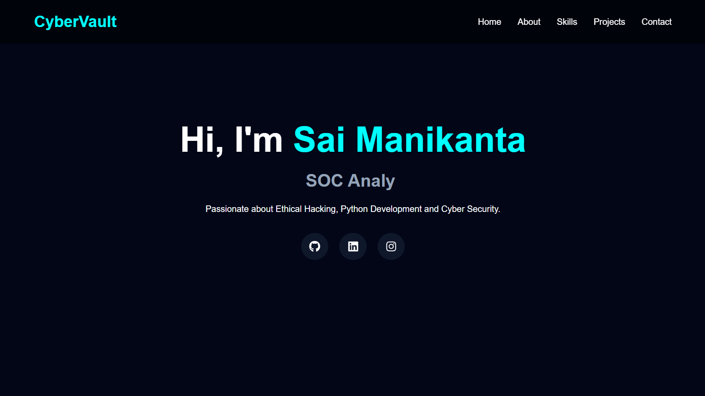

# 🔐  Portfolio

> Building secure systems, learning ethical hacking, and creating modern web experiences.

---

## 🚀 About The Project

My Portfolio is a modern cybersecurity-themed personal portfolio website developed using React and Vite.

This project represents my journey as a Cyber Security student and showcases my:

* Projects
* Technical Skills
* Learning Progress
* Certifications
* Contact Information

The portfolio is designed with a futuristic cyber UI inspired by terminal interfaces and hacking aesthetics.

---

## ✨ Features

✔️ Fully Responsive Design
✔️ Cybersecurity-Inspired UI
✔️ Smooth Scrolling Navigation
✔️ Animated Sections
✔️ Skills Showcase
✔️ Projects Section
✔️ Contact Form UI
✔️ Fast Performance with Vite
✔️ Beginner Friendly Structure

---

## 🖥️ Tech Stack

### Frontend

* React.js
* Vite
* JavaScript
* CSS3
* HTML5

### Tools & Platforms

* Git
* GitHub
* VS Code
* Vercel

---

## 📚 What I Learned

Through this project I learned:

* React Component Structure
* Responsive Web Design
* Git & GitHub Workflow
* Deployment using Vercel
* UI Design Principles
* Project Organization

---

## 📂 Project Structure

```bash
src/
│
├── assets/
├── components/
├── pages/
├── App.jsx
├── main.jsx
│
public/
```

---

## ⚙️ Installation & Setup

Clone the repository:

```bash
git clone https://github.com/SaiManikanta33/Portfolio
```

Navigate to the folder:

```bash
cd Portfolio
```

Install dependencies:

```bash
npm install
```

Run development server:

```bash
npm run dev
```

---

## 🏗️ Production Build

```bash
npm run build
```

---

## 🌐 Live Website

https://yourproject.vercel.app

---

## 📸 Screenshots



---

## 🎯 Future Improvements

* Add Dark/Light Mode
* Add Backend Integration
* Add Blog Section
* Add Cybersecurity Notes
* Add Real Contact Form
* Add Advanced Animations

---

## 🧠 Current Learning Goals

* MERN Stack Development
* Ethical Hacking
* Python Automation
* Linux Fundamentals
* Bug Bounty Hunting
* Web Security

---

## 👨‍💻 About Me

Hi, I'm **Sai Manikanta** 👋

🎓 B.Tech Cyber Security Student
💻 Passionate about Ethical Hacking & Web Development
🚀 Building projects and sharing my learning journey

---

## 🔗 Connect With Me

### GitHub

https://github.com/SaiManikanta33

### LinkedIn

https://linkedin.com/in/saimanikanta33

### Instagram

https://instagram.com/_spideyyy_19

---

## ⭐ Support

If you found this project helpful or interesting:

⭐ Star this repository
🍴 Fork the project
📢 Share feedback

---

## 📜 License

This project is licensed under the MIT License.

---

# 🔥 Keep Learning • Keep Building • Keep Securing
